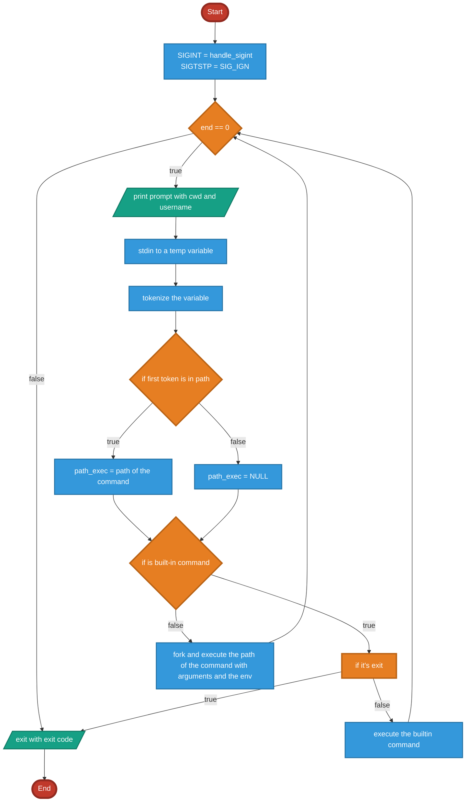

```mermaid
flowchart TB
    Start(["Start"]) --> def2["SIGINT = handle_sigint
    SIGTSTP = SIG_IGN"]
    def2 --> main_loop{"end == 0"}
    main_loop -- true --> prompt[/"print prompt with cwd and username"/]
    main_loop -- false --> exit[/"exit with exit code"/]
    exit --> End(["End"])
    prompt --> getline["stdin to a temp variable"]
    getline --> tokenize["tokenize the variable"]
    tokenize --> search_path{"if first token is in path"}
    search_path -- true --> path_exec1["path_exec = path of the command"]
    path_exec1 --> builtin{"if is built-in command"}
    search_path -- false --> path_exec2["path_exec = NULL"]
    path_exec2 --> builtin
    builtin -- true --> if_exit{"if it's exit"}
    if_exit -- true --> exit
    if_exit -- false --> exec_builtin["execute the builtin command"]
    exec_builtin --> main_loop
    builtin -- false --> exec_subprocess["fork and execute the path of the command with arguments and the env"]
    exec_subprocess --> main_loop

    if_exit@{ shape: rect}
    
    classDef startEnd fill:#C0392B,stroke:#922B21,color:#FDFEFE,stroke-width:4px
    classDef decision fill:#E67E22,stroke:#BA6315,color:#FDFEFE,stroke-width:3px
    classDef process fill:#3498DB,stroke:#2471A3,color:#FDFEFE,stroke-width:2px
    classDef io fill:#16A085,stroke:#117A65,color:#FDFEFE,stroke-width:2px
    
    class Start,End startEnd
    class main_loop,search_path,builtin,if_exit decision
    class def1,def2,getline,tokenize,path_exec1,path_exec2,exec_builtin,exec_subprocess process
    class prompt,exit io
```
