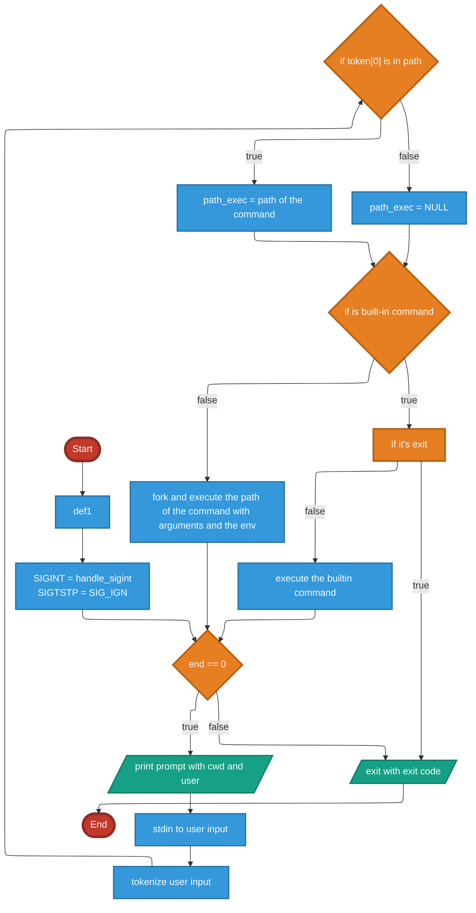

# **holbertonschool-simple_shell**

## **Description**

This repository contains the simple-shell project that was given to us to do in pairs by Holberton School as part of our learning program.

The goal of this project was:

- To train ourselves to work as a team
- To design a simple and valid flowchart
- To work while respecting the contrainst imposed by the checker
- To translate a diagram into working a C code
- To write clean, readable, and maintainable code.

This repository provides:

- A complete and validated flowchart
- The corresponding C implementation
- The compiler corresponding to the simple-shell project

Here is the list of allowed functions and system calls+:

- all functions from string.h
- access (man 2 access)
- chdir (man 2 chdir)
- close (man 2 close)
- closedir (man 3 closedir)
- execve (man 2 execve)
- exit (man 3 exit)
- \_exit (man 2 \_exit)
- fflush (man 3 fflush)
- fork (man 2 fork)
- free (man 3 free)
- getcwd (man 3 getcwd)
- getline (man 3 getline)
- getpid (man 2 getpid)
- isatty (man 3 isatty)
- kill (man 2 kill)
- malloc (man 3 malloc)
- open (man 2 open)
- opendir (man 3 opendir)
- perror (man 3 perror)
- printf (man 3 printf)
- fprintf (man 3 fprintf)
- vfprintf (man 3 vfprintf)
- sprintf (man 3 sprintf)
- putchar (man 3 putchar)
- read (man 2 read)
- readdir (man 3 readdir)
- signal (man 2 signal)
- stat (\_\_xstat) (man 2 stat)
- lstat (\_\_lxstat) (man 2 lstat)
- fstat (\_\_fxstat) (man 2 fstat)
- strtok (man 3 strtok)
- wait (man 2 wait)
- waitpid (man 2 waitpid)
- wait3 (man 2 wait3)
- wait4 (man 2 wait4)
- write (man 2 write)

It's one possible solution among others, but here's the one we came up with by creating our flowchart.

## **Flowchart**



## **Objectives**

At the end of the simple-shell project, we should be able to explain to anyone, without the help of google:

- Work collaboratively within a group of peers
- How our flowchart works and how we translated it into C code
- To be able to explain all the steps of all our codes
- Explain clearly how program work
- Read and design a flowchart describing program logic

## **Requierement**

The program for our simple-shell project will be compiled using:

```
gcc -Wall -Werror -Wextra -pedantic -std=gnu89 *.c -o hsh
```

- The code should use the Betty style. It will be checked using [betty-style.pl](https://github.com/hs-hq/Betty/blob/master/betty-style.pl) and [betty-doc.pl](https://github.com/hs-hq/Betty/blob/master/betty-doc.pl)
- No more than 5 function per file
- All our header files should be include guarded
- The prototypes of all our functions are included in our header file called "main.h".

## **Tech Stack**

- **Language:** C
- **Compiler:** GCC
- **IDE / Editor:** VS Code
- **Operating System:** Linux / Windows / Docker

## **File Description**

| **File**           | **Description**                                                                                                    |
| ------------------ | ------------------------------------------------------------------------------------------------------------------ |
| README.md          | Project documentation: Explain the purpose, installation steps, usage, project structure and the technologies used |
| man_1_simple_shell | Shell manual describing its usage and commands                                                                     |
| main.c             | Contains the main function of the program and starts its execution                                                 |
| main.h             | Program header file. It contains the prototypes of the functions and the structures used                           |
| prompt.c           | Contains the function that displays the prompt and reads the user's command                                        |
| split_arg.c        | Contains the function that splits a command into arguments                                                         |
| built_in_command.c | Contains the function that checks and executes the shell's built-in commands                                       |
| env.c              | Contains the function that extracts and displays environment variables                                             |
| shell_env.c        | Contains the function that displays all shell environment variables                                                |
| exit.c             | Contains the function that handles the exit command                                                                |
| search_path.c      | Contains the function that searches for a command in the PATH                                                      |
| start_subprocess.c | Contains the function that executes external commands in subprocesses                                              |
| exec_subprocess.c  | Contains the function that executes subprocess with execve                                                         |
| signal.c           | Contains the functions that handle signals (SIGINT, SIGTSTP)                                                       |
| \_atoi.c           | Contains a custom implementation of atoi function                                                                  |
| \_free.c           | Contains a custom memory deallocation function                                                                     |
| free_env.c         | Contains the function that frees environment variable arrays                                                       |

## **Installation and Usage**

### **Installation**

#### Clone this repository

- Open your terminal
- Navigate to the repository where you want to clone the repository
- Run the following command:

```
git clone https://github.com/ylabate/holbertonschool-simple_shell.git
```

#### Open the cloned repository
```
cd holbertonschool-simple_shell
```
#### Compile the program

```
gcc -Wall -Werror -Wextra -pedantic -std=gnu89 *.c -o hsh
```

### **Usage**

1 - Run the program

```
./hsh
```

When you run the command `env`, you should obtain output similar to this:

```
SHELL=/bin/bash
HOME=/home/ubuntu
LANG=C.UTF-8
PATH=/usr/local/sbin:/usr/local/bin:/usr/sbin:/usr/bin:/sbin:/bin
PWD=/home/ubuntu/holbertonschool-simple_shell
...
```

When you run the command `exit`, the program terminates:

```
hsh$ exit 0
$
```

## **Thanks**

We thank Holberton school for this simple-shell project and for allowing us to work in pairs

## **Authors**

### **Ylan Labare Bekate**

[Github](https://github.com/ylabate)

### **Théo Caulet**

[Github](https://github.com/theocaulet)

